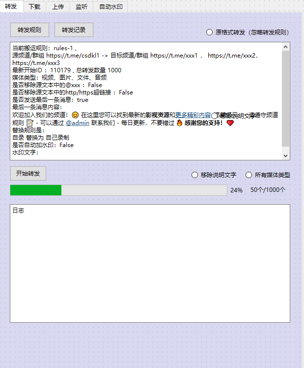
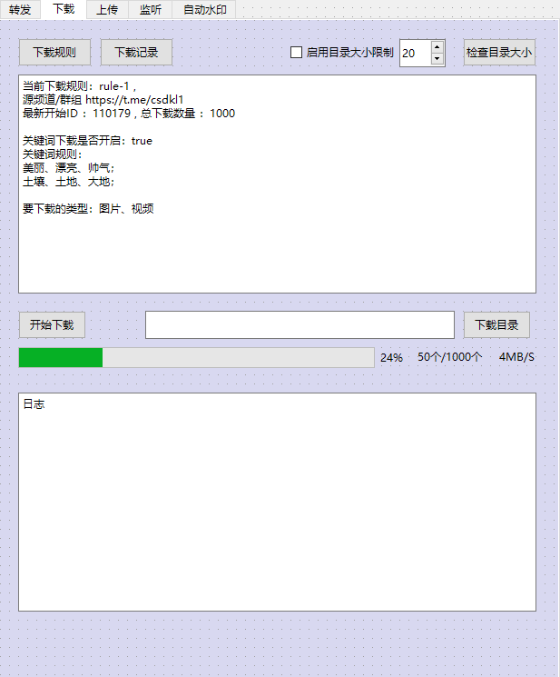
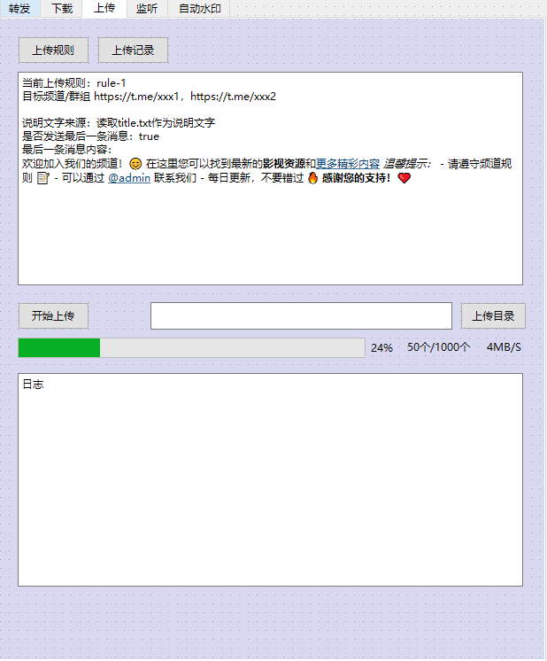
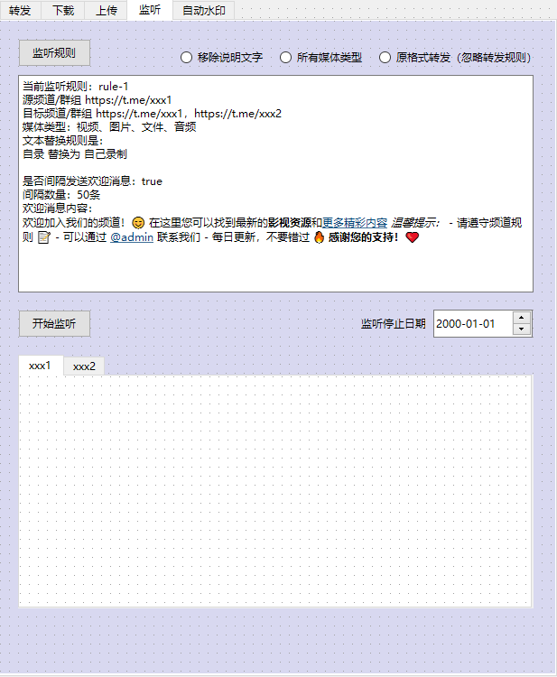

# Telegram TransHub 功能界面设计文档

本文档详细描述了 TransHub 功能的界面设计和实现要求，包括转发、下载、上传和监听四个主要功能模块。

## 开发指导

1. **实现顺序建议**：

   - 先实现基础框架和公共组件（导航栏等）
   - 按照转发 -> 下载 -> 上传 -> 监听的顺序实现各功能界面
   - 先完成 UI 框架，再添加功能逻辑

2. **语言文件更新**：

   - 在实现 UI 前，需要先在`lang.strings`中添加所有 UI 文本
   - 同时在`out/Release/Resources/lang_zh-hans.strings`中添加对应的中文翻译
   - 遵循`tr::lng_transhub_*`的命名规则

3. **示例参考**：

   - 对于复杂的 UI 组件实现，参考`info/`目录中的类似组件
   - 对于对话框实现，参考`boxes/`目录中的实现方式
   - 对于标签页切换，参考`settings/`目录中的实现方式

4. **图片说明**：

   - UI 文档中引用的图片已放入`images/`目录
   - 实际实现时注意细节与图片保持一致
   - 使用图片仅作为参考，实现应遵循 Telegram 设计规范

5. **实现策略备注**：

   - 各功能模块中的规则显示区域应在最后实现
   - 先实现基础 UI 框架和导航，再实现具体功能区域内容

6. **窗口类型选择**：

   - TransHub 应实现为一个 Layer 类型窗口，而非简单对话框
   - 推荐使用 `Ui::LayerWidget` 作为基类，参考 `info/info_layer_widget.h` 的实现
   - 这种窗口类型提供更大的界面空间，适合复杂的多标签页界面
   - 窗口类层次结构：
     ```
     TransHub::Window (Ui::LayerWidget)
      ├── TransHub::BaseSection
      ├── TransHub::ForwardSection
      ├── TransHub::DownloadSection
      ├── TransHub::UploadSection
      └── TransHub::MonitorSection
     ```

7. **当前实现与替换说明**：

   - 目前侧边栏中的 TransHub 按钮实现在 `window/window_filters_menu.cpp` 文件中
   - 该按钮被创建为一个特殊的文件夹按钮，使用 `Ui::FilterIcon::TransHub` 图标
   - 点击该按钮会调用 `Boxes::ShowTransHubBox(_session)` 函数，显示一个临时对话框
   - 临时对话框实现在 `boxes/transhub_box.cpp` 和 `boxes/transhub_box.h` 文件中
   - 新实现应保留相同的入口点（侧边栏按钮），但调用新的 TransHub 窗口代码
   - 具体修改方法：
     1. 在 `window/window_filters_menu.cpp` 中找到 TransHub 按钮的点击回调
     2. 将 `Boxes::ShowTransHubBox(_session)` 替换为新的 TransHub 窗口实现
     3. 在 `window/window_session_controller.h/.cpp` 中添加 `showTransHub()` 方法
     4. 该方法创建并显示新的 TransHub 窗口
     5. 保留原有的 `transhub_box.cpp/.h` 文件作为临时方案，直到新界面完全实现

8. **所有代码注释均使用英文**

## 通用界面要求

1. 设计风格需符合 Telegram 桌面客户端的整体设计语言
2. 所有文本必须支持本地化，通过`lang.strings`和`lang_zh-hans.strings`实现
3. 界面使用 Layer 窗口系统，通过`Ui::LayerWidget`派生类实现
4. 每个功能模块具有相同的顶部导航栏，可在各模块间切换
5. 所有界面需实现响应式布局，适应窗口尺寸变化

## 转发功能(转发)



### 界面元素

1. **顶部控制栏**

   - "转发规则"和"转发记录"两个标签页切换按钮
   - 右侧单选按钮组："原格式转发"(默认不选中)

2. **转发规则显示区域**

   > **实现备注**：转发规则显示区域内容暂时留空，等以后"转发规则"按钮的点击界面实现后，再实现转发规则显示区域内容的实现。

   - 当前规则 ID 显示："当前规则 ID: rules-1"
   - 源频道/群组行："源频道/群组 https://t.me/csdk1 -> 目标频道/群组 https://t.me/xxx1, https://t.me/xxx2, https://t.me/xxx3"
   - 最新开始 ID："最新开始 ID: 110179，总转发数量 1000"
   - 媒体类型行："媒体类型: 视频，图片，文件，音频"
   - 两个配置选项(复选框)：
     - "是否检测源文本中的@xxx：False"
     - "是否检测源文本中的 http/https 链接：False"
   - "是否发送缩略图：true"
   - 欢迎/限制消息区域
   - 几个布尔配置项："自定义格式为 自己定制"、"是否自动水印：False"
   - 水印文字输入区域

3. **底部控制区**
   - "开始转发"按钮
   - 右侧选项："移除描述文字"、"所有媒体类型"、"原格式转发"(三选一)
   - 进度条显示："24% 50 个/1000 个"
   - "日志"标题和日志文本框

### 交互要求

1. 规则内容区域应为可编辑文本框，用户可修改规则
2. 进度条需实时更新转发进度
3. 日志区域需自动滚动到最新日志
4. 转发过程中，"开始转发"按钮变为"停止转发"

## 下载功能(下载)



### 界面元素

1. **顶部控制栏**

   - "下载规则"和"下载记录"两个标签页切换按钮
   - 右侧配置："是用自定义小小报制"复选框及数字输入框(20)和"检查目录大小"按钮

2. **规则内容区域**

   > **实现备注**：下载规则显示区域内容暂时留空，等以后"下载规则"按钮的点击界面实现后，再实现下载规则显示区域内容的实现。

   - 当前规则 ID："当前下载规则: rule-1"
   - 源频道信息："源频道/群组 https://t.me/csdk1"
   - 最新开始 ID："最新开始 ID：110179，总下载数量：1000"
   - 关键词配置："关键词下载是开启：true"
   - 关键词规则："关键词规则："，包含多个关键词类别
   - 媒体类型："要下载的类型：图片、视频"

3. **底部控制区**
   - "开始下载"按钮和搜索框
   - "下载目录"按钮
   - 进度条："24% 50 个/1000 个 4MB/S"
   - "日志"标题和日志文本框

### 交互要求

1. 点击"开始下载"按钮开始下载过程
2. 进度条实时显示下载进度和速度
3. 搜索框允许用户输入额外的关键词
4. "下载目录"按钮打开文件浏览器，选择下载位置

## 上传功能(上传)



### 界面元素

1. **顶部控制栏**

   - "上传规则"和"上传记录"两个标签页切换按钮

2. **规则内容区域**

   > **实现备注**：上传规则显示区域内容暂时留空，等以后"上传规则"按钮的点击界面实现后，再实现上传规则显示区域内容的实现。

   - 当前规则 ID："当前上传规则: rule-1"
   - 目标频道："目标频道/群组 https://t.me/xxx1, https://t.me/xxx2"
   - 说明文本相关配置："说明文本来源：读取 title.txt 作为说明文字"
   - "是否发送缩略图：true"
   - 集合图片相关配置
   - 欢迎消息区域

3. **底部控制区**
   - "开始上传"按钮和文件选择框
   - "上传目录"按钮
   - 进度条："24% 50 个/1000 个 4MB/S"
   - "日志"标题和日志文本框

### 交互要求

1. 点击"开始上传"按钮开始上传过程
2. 进度条实时显示上传进度和速度
3. 文件选择框允许用户选择要上传的文件
4. "上传目录"按钮显示已上传内容的目录

## 监听功能(监听)



### 界面元素

1. **顶部控制栏**

   - "监听规则"标签页按钮
   - 右侧选项："移除描述文字"、"所有媒体类型"、"原格式转发"(三选一)

2. **规则内容区域**

   > **实现备注**：监听规则显示区域内容暂时留空，等以后"监听规则"按钮的点击界面实现后，再实现监听规则显示区域内容的实现。

   - 当前规则 ID："当前监听规则: rule-1"
   - 源频道信息："源频道/群组 https://t.me/xxx1, https://t.me/xxx2"
   - 媒体类型："媒体类型: 视频, 图片, 文件, 音频"
   - "文本替换规则："行
   - 格式设置："自定义 格式为 自己定制"
   - 是否同时转发："是否同时转发：true"
   - 间隔时间："间隔时间：50 秒"
   - 欢迎消息区域

3. **底部控制区**
   - "开始监听"按钮
   - 右侧："监听停止日期 2000-01-01"日期选择器
   - 标签按钮："xxx1"和"xxx2"
   - 大型空白区域(可能是监听内容预览)

### 交互要求

1. 点击"开始监听"按钮开始监听过程
2. 日期选择器可设置自动停止监听的时间
3. 标签按钮用于切换不同的监听频道
4. 下方大型区域显示监听到的内容预览

## 全局导航

每个功能界面顶部都有相同的标签栏，用于在四个主要功能间切换：

- 转发
- 下载
- 上传
- 监听

## 实现建议

1. 创建`transhub`命名空间和相关文件结构：

   ```
   Telegram/SourceFiles/transhub/
   ├── transhub_forward.cpp
   ├── transhub_forward.h
   ├── transhub_download.cpp
   ├── transhub_download.h
   ├── transhub_upload.cpp
   ├── transhub_upload.h
   ├── transhub_monitor.cpp
   ├── transhub_monitor.h
   ├── transhub_common.cpp
   ├── transhub_common.h
   └── transhub_window.h/cpp (主窗口管理)
   ```

2. 使用以下类层次结构：

   - `TransHub::Window` - 主窗口，管理标签切换
   - `TransHub::BaseSection` - 基础部分，包含共享 UI 元素
   - `TransHub::ForwardSection` - 转发功能界面
   - `TransHub::DownloadSection` - 下载功能界面
   - `TransHub::UploadSection` - 上传功能界面
   - `TransHub::MonitorSection` - 监听功能界面

3. 实现路径：

   - 在`Telegram/SourceFiles/window/main_window.cpp`中添加 TransHub 入口点
   - 在主菜单或侧边栏添加 TransHub 按钮
   - 创建 TransHub 主窗口并实现功能切换
   - 逐步实现各功能模块

4. 语言添加：
   - 在`lang.strings`中添加所有 UI 文本定义
   - 在`lang_zh-hans.strings`中添加对应的中文翻译
